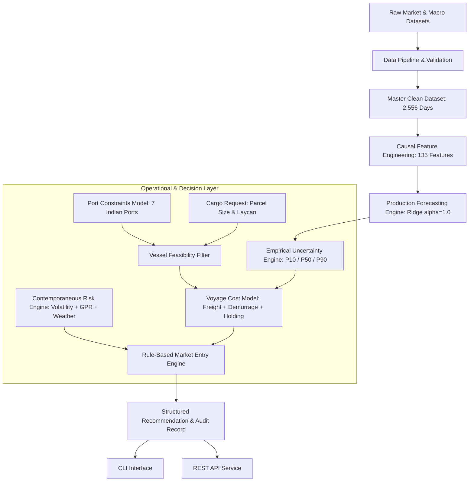

# FICOS System Architecture Document

## 1. Overview

**FICOS (Freight Intelligence & Charter Optimization System)** is a decision-support platform designed to forecast historical dry-bulk freight rates, quantify forecast uncertainty, evaluate vessel and port constraints, estimate voyage costs, and generate explainable chartering recommendations for raw material imports to East Coast Indian ports.

---

## 2. End-to-End System Architecture

---

## 3. Layer-by-Layer Architectural Decomposition

### Layer 1: Data Ingestion & Quality Pipeline (`src/data/`)
- Ingests raw commodity, freight, fuel, foreign exchange, geopolitical risk (GPR), fleet, and meteorological datasets.
- Cleans, parses, aligns dates, forward-fills non-trading macroeconomic series, and strictly validates that freight targets have zero missing values on Baltic trading sessions.
- Produces the immutable `data/processed/master_dataset.csv` (2,556 calendar days, 2012-08-01 to 2019-07-31).

### Layer 2: Causal Feature Engineering (`src/features/`)
- Constructs 135 causal variables across 7 distinct feature families (AR lags, cross-vessel cross-lags, momentum differences, rolling volatility, macro indicators, GPR metrics, and calendar features).
- Strictly enforces causal target alignment ($Y_{t+1} \sim X_t$) with zero future lookahead.
- Produces `data/features/freight_features.csv` (1,749 trading sessions).

### Layer 3: Production Forecasting Engine (`src/models/`)
- **Champion Model**: **Ridge Regression ($\alpha=1.0$)** with training-only feature standardization.
- Empirically proved across 5 expanding-window walk-forward folds to deliver the lowest Mean MAE, lowest error variance across diverse historical regimes, and highest Directional Accuracy (~79–80%).

### Layer 4: Empirical Uncertainty Quantification (`src/decision/uncertainty.py`)
- Evaluates out-of-sample prediction error distributions from walk-forward validation.
- Extracts non-parametric empirical quantiles ($P_{10}, P_{50}, P_{90}$).
- Scales uncertainty bounds over multi-step forecast horizons ($H=7$) via diffusion scaling $\sqrt{h}$.

### Layer 5: Vessel Suitability & Port Navigational Model (`src/decision/charter.py`, `configs/ports.yaml`)
- Models physical draft, LOA, beam, and DWT limits for: **Paradip**, **Vizag**, **Gangavaram**, **Gopalpur**, **Dhamra**, **Sagar-Sandheads**, and **Haldia**.
- Dynamically matches cargo parcel sizes (e.g. 30k MT to Haldia $\to$ Handysize; 175k MT to Gangavaram $\to$ Capesize).

### Layer 6: Transparent Voyage Cost Engine
- Evaluates total expected voyage cost across timing options (Day 0 = Charter Now, Day 1..7 = Wait):
  $$\text{Total Cost}(d) = \text{Freight Hire Cost}(d) + \text{Port Stay Demurrage} + \text{Holding Delay Cost}(d)$$

### Layer 7: Multi-Factor Contemporaneous Risk Engine
- Evaluates 4 contemporaneous risk signals:
  1. Forecast dispersion ($P_{90} - P_{10}$ width / spot level).
  2. Structural vessel segment volatility.
  3. Geopolitical Risk (GPR) spike ratio relative to 30-day moving average.
  4. Port approach coastal weather disruption alerts.
- Classifies risk into `LOW`, `MEDIUM`, or `HIGH`.

### Layer 8: Rule-Based Charter Decision Engine
- **`CHARTER NOW`**: Forecasted rise $\ge +1.5\%$ or `HIGH` risk in non-falling market.
- **`WAIT`**: Projected decline yields net cost savings $\ge 2.0\%$ (net of daily holding penalties) and risk is not `HIGH`.
- **`FLEXIBLE / MONITOR`**: Projected movement within uncertainty noise band ($< 1.5\%$).

### Layer 9: Application, Orchestration & Audit Layer (`src/application/`)
- Coordinates validation, feature loading, Ridge inference, risk scoring, and decision execution into a single unified `FICOSService`.
- Exposes clean CLI (`python -m src.application`) and REST endpoints (`GET /health`, `POST /recommend`).
- Produces immutable, reproducible audit records.

---

## 4. Architectural Decision Records (ADRs)

### ADR 1: Selection of Ridge Regression as Production Forecaster
- **Context**: Baltic freight sub-indices exhibit unit-root persistence ($ACF_1 > 0.97$).
- **Evidence**: In expanding walk-forward cross-validation across 1,000 out-of-sample trading days, Ridge achieved the lowest Mean MAE ($1.97$ for HSI, $4.21$ for SI, $10.10$ for PI, $63.82$ for CI) and highest Directional Accuracy (79.3% to 80.4%).
- **Decision**: Ridge ($\alpha=1.0$) was selected as the sole production forecasting champion.

### ADR 2: Rejection of Decision Trees (XGBoost) and Deep Learning (LSTM)
- **XGBoost**: Piecewise constant step quantization created higher point errors and inability to extrapolate outside historical training bounds during market squeezes.
- **LSTM**: Severe parameter overcapacity and recurrent memory gating phase lag on ~1,350 daily sequences.
- **Decision**: XGBoost and LSTM remain strictly as evaluated research benchmarks.

### ADR 3: Rejection of Forced Ensembling
- **Evidence**: In Phase 8 walk-forward testing, blending Ridge with XGBoost (50/50 ensemble) yielded Mean MAE of 65.63 on Capesize (worse than pure Ridge at 63.82) and 15.23 on Panamax (worse than pure Ridge at 10.10).
- **Decision**: Forced ensembling was rejected because mixing noisy tree predictions degraded Ridge's precision.

### ADR 4: Rejection of Reinforcement Learning (RL) and Direct LLM Forecasting
- **Decision**: Transparent, rule-based decision logic was chosen over black-box RL or LLM agents to ensure 100% determinism, mathematical auditability, and regulatory compliance.

### ADR 5: Separation of Decision-Time Achievable Results from Hindsight Benchmarks
- **Decision**: All live decisions use strictly contemporaneous information available at date $T$ ($t \le T$). Hindsight oracle benchmarks are computed separately for retrospective evaluation and never presented as decision-time knowledge.
